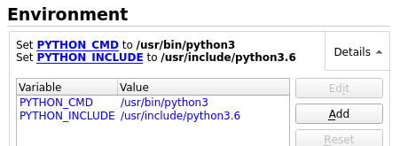

# Python Bindings for Darwin: Setup

> Only Python 3 is supported (3.6+ recommended). Anywhere `python` is
> referenced in these instructions, it refers to the python 3 interpreter,
> which on some systems may be named differently (ex. `python3`)

### Building

First, make sure all the [prerequisites](setup.md#general-prerequisites)
are available. Even though the Python bindings don't link against Qt, it
is still required for the build system (qmake).

1. Export `QTDIR` to point to the Qt location
   (ex. `export QTDIR=/home/user/tools/qt/5.14.2/gcc_64`)

2. `python setup.py install`

> When using Microsoft Visual C++, you need to run `setup.py` from a "MSVC++
command prompt" (ex. by running MSVC++'s `vcvarsall.bat` first)

### Running the Python Unit Tests

First, change the directory to the project root location
(containing the `setup.py` and `darwin.pro` files) and build the
Python bindings.

Running the tests also require a temporary location for storing test files. 
The `DARWIN_HOME_PATH` must be set to point to this location, for example:
`export DARWIN_HOME_PATH=tests/.temp` (`setup.py` will automatically do this
if `DARWIN_HOME_PATH` is not already set, so this is not neccesary for
option 2)

Option 1: `python -m unittest discover tests/bindings/python`

Option 2: `python setup.py test`

Option 3: Run individual test files directly
  (ex. `python tests/bindings/python/test_core.py`)

Option 4: Use your favorite Python test runner
  (Python tests are under `tests/bindings/python`)

### Building and Testing from Qt Creator

Building the Python extension requires a few environment variables to be
set:

| Env variable                    | Value                                 |
|---------------------------------|---------------------------------------|
| `PYTHON_INCLUDE`                | `Python.h` location                   |
| `PYTHON_CMD`                    | Python interpreter (ex. `python3`)    |
| `PYTHON_LIBS` (Windows Only)    | `python*.lib` location                |

The recommended way to set these environment variables is from 
`Projects` / `Environment` settings page in Qt Creator:

Once these variables are set, a full rebuild will also build the 
Python extension and there's a wrapper test case which will execute
all the Python unit tests (`PythonBindingsTest`)
