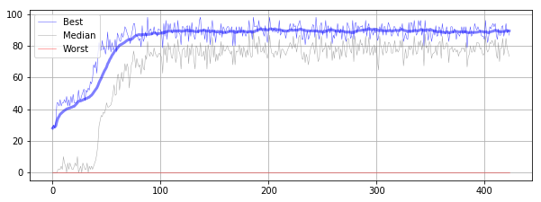
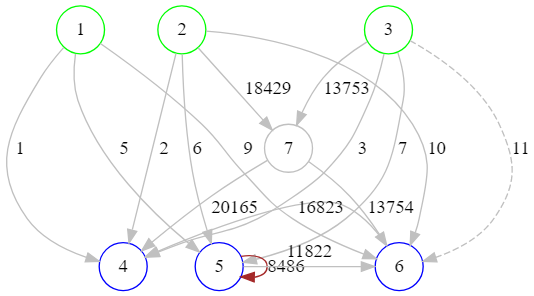
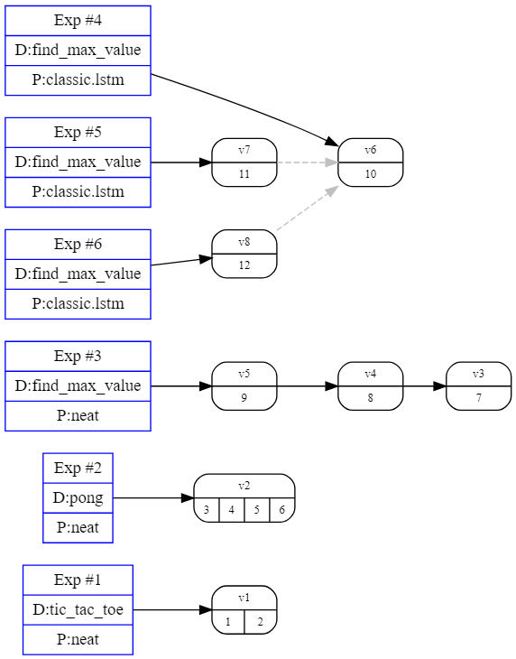
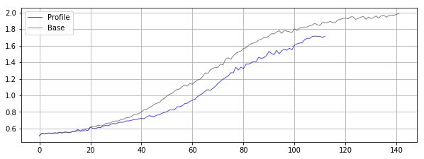

# Darwin Scripts

[Overview](#overview)
[fitness_chart.py](#fitness_chartpy)
[fitness_dist.py](#fitness_distpy)
[fitness_diff.py](#fitness_diffpy)
[neat_genotype_exporter.py](#neat_genotype_exporterpy)
[universe_summary.py](#universe_summarypy)
[universe_graph.py](#universe_graphpy)
[perf_chart.py](#perf_chartpy)

# Overview

The `scripts` directory contains a collection of Python programs which read a universe
database and output various digested results (charts, dot files, ...). The scripts are
experimental and currently there's no test suite for the scripts.

The scripts are written in Python 3 and they may use additional libraries
(ex. `matplotlib`, `seaborn`, ...). Most of them output charts so a Python environment
with support for graphical output is recommended:

- [Jupyter QtConsole](https://qtconsole.readthedocs.io/en/stable/#)
- [Jupyter Notebook](http://jupyter.org)
- [Spyder IDE](https://www.spyder-ide.org)

# fitness_chart.py

Plots the best/median/worst fitness samples across the specified evolution trace.

```
usage: fitness_chart.py [-h] -u UNIVERSE -t TRACEID [-o OUTPUT]

Evolution fitness visualization

optional arguments:
  -h, --help            show this help message and exit
  -u UNIVERSE, --universe UNIVERSE
                        Darwin universe database
  -t TRACEID, --traceid TRACEID
                        Evolution Trace ID
  -o OUTPUT, --output OUTPUT
                        Save chart to the specified file (in a format
                        supported by matplotlib)
```

**Example**: `fitness_chart.py -u universe.darwin -t 9`



# fitness_dist.py

Plots the distribution(s) of fitness values over the generations in the specified
evolution trace. It uses a color gradient to illustrate the distribution change (somewhat
similar to [Onion skinning](https://en.wikipedia.org/wiki/Onion_skinning).

- By default, 10% of the generations are plotted. --sample-percent can select a different
  sampling percent.
- If `--sorted` is used, the raw, sorted fitness values are plotted instead.

```
usage: fitness_dist.py [-h] -u UNIVERSE -t TRACEID [-s SAMPLE_PERCENT]
                       [--sorted] [-o OUTPUT]

Fitness distribution visualization

optional arguments:
  -h, --help            show this help message and exit
  -u UNIVERSE, --universe UNIVERSE
                        Darwin universe database
  -t TRACEID, --traceid TRACEID
                        Evolution Trace ID
  -s SAMPLE_PERCENT, --sample-percent SAMPLE_PERCENT
                        The percent of generations to plot
  --sorted              Plot the raw, sorted fitness values
  -o OUTPUT, --output OUTPUT
                        Save chart to the specified file (in a format
                        supported by matplotlib)
```

**Example**: `fitness_dist.py -u universe.darwin -t 6`


**Example using --sorted**: `fitness_dist.py -u universe.darwin -t 6 --sorted`


# fitness_diff.py

Plots the fitness values for two evolution traces (diff/base)

```
usage: fitness_diff.py [-h] -u UNIVERSE -tb BASE_TRACEID -td DIFF_TRACEID
                       [-o OUTPUT] [--all-generations]

Fitness diff tool

optional arguments:
  -h, --help            show this help message and exit
  -u UNIVERSE, --universe UNIVERSE
                        Darwin universe database
  -tb BASE_TRACEID, --base_traceid BASE_TRACEID
                        Evolution Trace ID
  -td DIFF_TRACEID, --diff_traceid DIFF_TRACEID
                        Evolution Trace ID
  -o OUTPUT, --output OUTPUT
                        Save chart to the specified file (in a format
                        supported by matplotlib)
  --all-generations     Don't limit the chart to the shared generations only
```

**Example**: `fitness_diff.py -u universe.darwin -td 9 -tb 8 --all-generations`


# neat_genotype_exporter.py

Exports a NEAT genotype as a [Graphviz](https://www.graphviz.org/) graph definition.

```
usage: neat_genotype_exporter.py [-h] -u UNIVERSE -t TRACEID -g GENERATION
                                 [--explicit-bias]

NEAT Genotype Exporter

optional arguments:
  -h, --help            show this help message and exit
  -u UNIVERSE, --universe UNIVERSE
                        Darwin universe database
  -t TRACEID, --traceid TRACEID
                        Evolution Trace ID
  -g GENERATION, --generation GENERATION
                        Generation (from which to export the champion
                        genotype)
  --explicit-bias       Show the bias node
```

**Example**: `neat_genotype_exporter.py -u universe.darwin -t 9 -g 1000`

The raw output is [Graphviz DOT language](https://www.graphviz.org/documentation/):

```python
# traceid = 9
# generation = 1010
# inputs = 3
# outputs = 3
digraph genotype {
  node [shape=circle, color=gray];
  edge [color=gray];
  # Input nodes
  { rank=same; node [color=green]; edge [style=invis]; 1->2->3 }
  # Hidden nodes
  { rank=same; node [color=gray]; edge [style=invis]; 7 }
  # Output nodes
  { rank=same; node [color=blue];  edge [style=invis]; 4->5->6 }
  # Links (genes)
  1->4 [label=1][style=solid, color=gray];
  2->4 [label=2][style=solid, color=gray];
  3->4 [label=3][style=solid, color=gray];
  1->5 [label=5][style=solid, color=gray];
  2->5 [label=6][style=solid, color=gray];
  3->5 [label=7][style=solid, color=gray];
  1->6 [label=9][style=solid, color=gray];
  2->6 [label=10][style=solid, color=gray];
  3->6 [label=11][style=dashed, color=gray];
  5->5 [label=8486][style=solid, color=brown];
  5->6 [label=11822][style=solid, color=gray];
  3->7 [label=13753][style=solid, color=gray];
  7->6 [label=13754][style=solid, color=gray];
  6->4 [label=16823][style=solid, color=gray];
  2->7 [label=18429][style=solid, color=gray];
  7->4 [label=20165][style=solid, color=gray];
}
```

This output can be used with any tool accepting Graphviz DOT.
Using the raw output above, [Viz.js](http://viz-js.com) will generate the following
visualization:



# universe_summary.py

Dumps a human readable summary of the specified universe database.

```
usage: universe_summary.py [-h] [-s] [-v] universe

Darwin Universe Summary

positional arguments:
  universe       Darwin universe database

optional arguments:
  -h, --help     show this help message and exit
  -s, --stats    Gather evolution trace state (can be very slow if there are
                 many generations)
  -v, --verbose  Show detailed information
```

**Example**: `universe_summary.py -s universe.darwin`

```
Experiment #1 : tic_tac_toe / neat[5000] 
  Variation #1 :
    Trace #1 : 2018-09-23, 21:49:12 (38 generations, max_fitness = 5.00)
    Trace #2 : 2018-09-23, 21:49:38 (25 generations, max_fitness = 5.00)

Experiment #2 : pong / neat[5000] 
  Variation #2 :
    Trace #3 : 2018-09-24, 20:59:02 (7 generations, max_fitness = 500.00)
    Trace #4 : 2018-09-28, 21:06:33 (21 generations, max_fitness = 500.00)
    Trace #5 : 2018-09-28, 21:07:00 (113 generations, max_fitness = 500.00)
    Trace #6 : 2018-09-28, 21:09:12 (142 generations, max_fitness = 500.00)

Experiment #3 : find_max_value / neat[5000] 
  Variation #3 :
    Trace #7 : 2018-09-29, 14:12:34 (200 generations, max_fitness = 48.00)
  Variation #4 :
    Trace #8 : 2018-09-29, 14:12:58 (1167 generations, max_fitness = 63.33)
  Variation #5 :
    Trace #9 : 2018-09-29, 14:16:39 (1131 generations, max_fitness = 63.33)

Experiment #4 : find_max_value / classic.lstm[5000] 
  Variation #6 :
    Trace #10 : 2018-09-29, 14:28:42 (424 generations, max_fitness = 98.00)
```

# universe_graph.py

```
use universe_graph <universe_db>
```

**Example**: `universe_graph.py universe.darwin`

The raw output is [Graphviz DOT language](https://www.graphviz.org/documentation/) and
it can be rendered using any tools accepting Graphviz definitions:



# perf_chart.py

Creates a basic chart of the time-per-generation runtime profile. It can optionally
plot a base/reference trace (`-tb`). The values are in seconds.

```
usage: perf_chart.py [-h] -u UNIVERSE -t TRACEID [-tb BASE_TRACEID]
                     [-o OUTPUT] [--all-generations]

Runtime perf plotting tool

optional arguments:
  -h, --help            show this help message and exit
  -u UNIVERSE, --universe UNIVERSE
                        Darwin universe database
  -t TRACEID, --traceid TRACEID
                        Evolution Trace ID
  -tb BASE_TRACEID, --base_traceid BASE_TRACEID
                        Evolution Trace ID
  -o OUTPUT, --output OUTPUT
                        Save chart to the specified file (in a format
                        supported by matplotlib)
  --all-generations     Don't limit the chart to the shared generations only
```

**Example**: `perf_chart.py -u universe.darwin -t 6 -tb 5 --all-generations`


